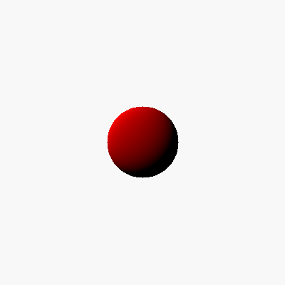

Very simple ray tracer, solely for learning purposes.

This was part of an assignment for the edX online graphics class:

https://courses.edx.org/courses/course-v1:UCSDx+CSE167x+2T2016/info

So far, just rendering a simple sphere:

